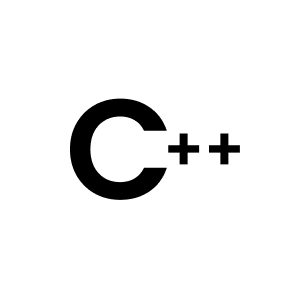

<h1>Hi! 👋</h1>

<!--
**PranavPrakasan07/PranavPrakasan07** is a ✨ _special_ ✨ repository because its `README.md` (this file) appears on your GitHub profile.
Here are some ideas to get you started:
-->

🔭 I’m currently working on **Native App Development**

🌱 I’m currently learning **Unity**

👯 I’m looking to collaborate on **App/Game Dev/ML Projects**

🤔 I’m looking for help with **ML in App-Dev**

💬 Ask me about **Native App Development, UI/UX Designing**

 
<!-- 

 -->

 
<h2>FIND ME AT</h2>

 ⁃ 
 ⁃ 

 

<!--
- 😄 Pronouns: ...
- ⚡ Fun fact: ...
-->

 

  
  

 

   
  
  
   

  
  
   
  
   

   
  
   

   
  

 

<h2>GITHUB STATS</h2>  
 

